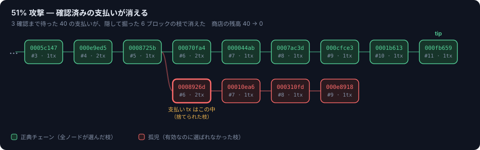
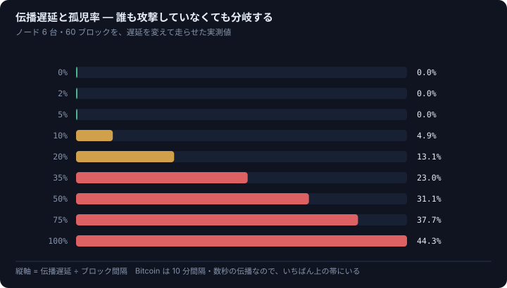
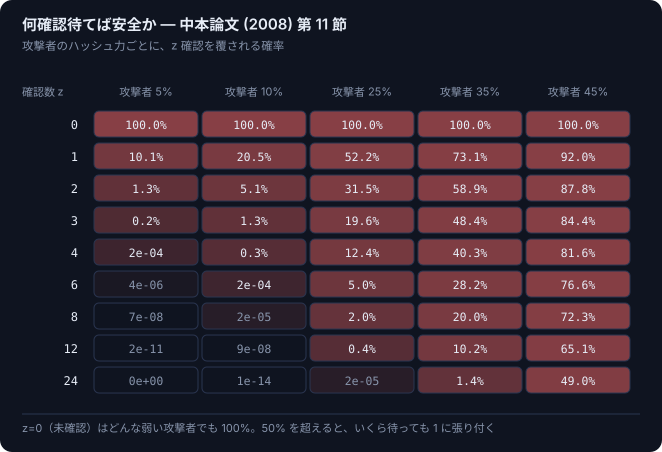

<div align="center">

# chain-study

**ブロックチェーンを標準ライブラリだけでゼロから組み、壊して理解する**

[](https://github.com/macha0070/chain-study/actions/workflows/ci.yml)
[](https://www.python.org/)
[](#方針)
[](LICENSE)
[](https://codespaces.new/macha0070/chain-study?quickstart=1)

</div>

`pip install` を 1 回もせずに、ハッシュから合意形成までを自分の手で書く。
書いたものは Web UI から動かせて、**教科書に載っている攻撃を自分のチェーンに対して成功させられる。**

<div align="center">

</div>

上の図は説明用のイラストではない。`python tools/render_svg.py` が
**実際にチェーンを走らせて攻撃を成功させ、その結果の形を描いたもの**。
赤いブロックは壊れていない。署名も PoW も全部有効なまま、選ばれなくなっただけ。

---

## 30 秒で動かす

```bash
docker compose up
```

→ http://localhost:8000

Docker なしでも動く（追加パッケージ不要）。

```bash
python web/server.py
```

ブラウザすら要らないなら:

```bash
python chain/demo.py
```

<details>
<summary><b>English summary</b></summary>

A blockchain built from scratch in pure Python — **zero dependencies**, not even a
crypto library. secp256k1 point arithmetic, ECDSA, Merkle trees, UTXO validation,
proof of work, longest-chain consensus, and a latency-simulating P2P layer are all
implemented by hand.

The point is not that it works. The point is that it **breaks**, on purpose:
private key recovery from nonce reuse (PS3, 2010), CVE-2012-2459 Merkle root
collisions, and a 51% double-spend that erases a payment with 3 confirmations.
Every attack is reproducible from a button in the web UI, and CI asserts that each
one still succeeds — so the teaching material can't silently drift from the code.

Comments and docs are in Japanese. `docker compose up` → http://localhost:8000

</details>

---

## 何が見えるか

### 1. 誰も攻撃していなくても分岐する



伝播に時間がかかる限り、誰かが掘っている間に別の誰かも掘る。
孤児率はおおよそ「伝播遅延 ÷ ブロック間隔」に比例する。
**Bitcoin がブロック間隔を 10 分という長さに置いている理由がこれ。**
UI のスライダーを動かすと、この曲線の上を実際に移動できる。

### 2. 「確定」は存在しない



中本論文 (2008) 第 11 節の式そのもの（`chain.attacker_success_probability`）。
z=0（未確認）ではどんな弱い攻撃者でも成功率 100%、50% を超えると
いくら待っても 1 に張り付く。**安全性とは、攻撃費用が引き合わないという状態のこと。**

### 3. ブラウザから壊せる

`docker compose up` して、次の順にやってみてほしい。

1. **20 ブロック** を押す — ノード 4 台が、それぞれ自分の視点でチェーンを伸ばす
2. **伝播遅延** を上げる — 赤い孤児ブロックが枝分かれし始める
3. **二重支払い (51%)** を押す — Alice が Merchant に払い、3 確認を待って商品が
   発送され、そのあと隠し枝の公開で支払いが消えるまでが自動で走る
4. **消えた赤いブロックをクリックする** — 中に支払い tx がそのまま入っている

4 が全部だと思っている。ブロックは壊れていない。ただ選ばれなかっただけ。

---

## 実際に再現できる攻撃

| 攻撃 | 何が起きるか | 現実の事例 |
|---|---|---|
| **nonce 再利用** | 署名 2 本と逆元 2 回で秘密鍵が復元される。曲線もハッシュも無傷のまま | PS3 (2010) / Android ウォレット (2013) |
| **署名延性** | 秘密鍵なしで、同じ tx の別の有効な署名が作れる | Mt.Gox / SegWit の動機 |
| **マークル根の衝突** | 中身の違う tx リストが同じ根を持つ | CVE-2012-2459 |
| **リオーグ二重支払い** | 3 確認済みの支払いが、後から現れた重い枝で消える | 51% 攻撃（ETC, BTG などで実例） |

対策は **わざと入れていない**。先に対策を書くと、なぜそれが要るのか分からないまま
通り過ぎてしまうから。塞ぐところまでが [EXERCISES.md](EXERCISES.md) の課題。

そして **攻撃が成功し続けること自体がテストになっている** — 教材の主張とコードが
静かにずれるのを止めるため。CI は毎回、コンテナを起動して API 越しに攻撃を成功させている。

---

## 課題を解くとテストが緑になる

```bash
python tools/progress.py
```

```
  課題（EXERCISES.md）
  --------------------------------------------------------
  ⬜  課題 1  RFC 6979（決定的 ECDSA）
        → chain/ecdsa.py に sign_rfc6979 を実装する
  ⬜  課題 2  マークル木のドメイン分離
  ...
  進捗  ░░░░░░░░░░░░░░░░░░░░░░░░░░░░  0/6
```

課題ごとに関数名とシグネチャが決まっていて、実装するとスキップされていたテストが
実行に変わる。**進捗はテストの色で分かる。**

```bash
python -m unittest tests.test_exercises -v
```

課題は 6 つ。RFC 6979、ドメイン分離ハッシュ、難易度調整、タイムスタンプ検証、
SHA-256 の自作、Schnorr 署名。詳しくは [EXERCISES.md](EXERCISES.md)。

---

## 実装したもの

| Phase | テーマ | 到達判定 |
|---|---|---|
| 1 | [ハッシュ関数](chain/hashing.py) | 雪崩効果の平均が 128 ビット、PoW 試行回数が 2^d |
| 2 | [楕円曲線 secp256k1](chain/curve.py) | E(F_97) の全点列挙、N·G = O |
| 3 | [ECDSA](chain/ecdsa.py) | **nonce 再利用で秘密鍵を復元できた** |
| 4 | [マークル木](chain/merkle.py) | **CVE-2012-2459 を再現できた** |
| 5 | [UTXO とトランザクション](chain/tx.py) | 5 種類の不正 tx が別々のルールで落ちる |
| 6 | [ブロックと PoW](chain/block.py) | ヘッダ 1 ビットの変更で PoW が即無効 |
| 7 | [最長鎖と合意](chain/chain.py) | **3 確認済みの支払いをリオーグで消せた** |
| 8 | [P2P と伝播](chain/node.py) | **遅延 ÷ 間隔と孤児率が比例することを実測** |

この先（スクリプト、アカウントモデル、PoS、zk）は [docs/roadmap.md](docs/roadmap.md)。

---

## 構成

```
chain/            エンジン。ここが本体で、web/ を知らない
  hashing.py      ハッシュ、雪崩効果、PoW の難易度
  curve.py        secp256k1（点加算・スカラー倍・圧縮公開鍵）
  ecdsa.py        署名・検証・延性・nonce 再利用攻撃
  merkle.py       マークル木・包含証明・CVE-2012-2459
  tx.py           UTXO・アドレス・ウォレット・5 本の検証ルール
  block.py        ブロックヘッダ・マイニング
  chain.py        最長鎖・リオーグ・確認回数の計算
  node.py         P2P ノード・伝播遅延・自然な分岐と孤児
  scenario.py     51% 攻撃の手順（CLI からも UI からも使う）
  demo.py         全部を通して実行し、観察ポイントを出力する
web/
  server.py       http.server だけで書いた JSON API + 静的配信
  static/         ダッシュボード（素の HTML/CSS/JS、ビルド工程なし）
tests/
  test_chain.py       回帰テスト 53 件
  test_exercises.py   課題テスト 31 件（解くと skipped → ok）
tools/
  render_svg.py   README の図をチェーンから生成する
  progress.py     課題の進み具合を表示する
```

依存は一方向: `hashing → curve → ecdsa → merkle → tx → block → chain → node → scenario`。
下の層だけを読んでも成立するように書いてある。

---

## 方針

- **ライブラリに頼らない。** secp256k1 の点加算もスカラー倍も自前。HTTP サーバも
  `http.server` だけ。`Dockerfile` に `pip install` が 1 行もないのは、手抜きではなく方針の帰結。
  CI は `requirements.txt` の存在を検査して落とす。
- **小さいパラメータで遊ぶ。** 256 ビットの曲線では何も観察できない。
  `curve.small_curve_demo()` は F_97 上の 100 点を全部並べる。
- **速度は後回し。** 楕円曲線はアフィン座標、UTXO 集合は毎回 genesis から再生する。
  実用では論外だが、式と構造がそのまま読める。
- **壊してから直す。** 攻撃を先に成功させ、対策は課題として残す。
- **模擬と実物を混ぜない。** `node.py` の PoW は本物だが、「次に誰がいつ当てるか」は
  指数分布からの抽選で模擬している。この割り切りは冒頭に明記してある。
  結果の読み方を間違えさせないため。

手を入れるときの詳しい約束は [CONTRIBUTING.md](CONTRIBUTING.md)。

---

## テスト

```bash
python -m unittest discover -s tests -v      # 84 件（うち課題 31 件はスキップ）
docker compose run --rm tests                # 統計テスト込みでコンテナ内実行
```

<details>
<summary>テストが実際に見つけた不具合</summary>

`test_negative_amount_rejected` を書いたときに、負の額を持つ tx が
**検証で拒否される前に直列化で例外を投げる** ことが分かった。
つまり不正な tx を投げるだけでノードを落とせる（DoS）。

パーサと直列化は、どんな入力に対しても全域でなければならない。
`Tx.core_bytes()` を `signed=True` に修正済み（[chain/tx.py](chain/tx.py)）。
「検証で弾く」と「処理中に落ちる」はまったく別のことだ、という教訓つき。

</details>

---

## 参考文献

- Satoshi Nakamoto, *Bitcoin: A Peer-to-Peer Electronic Cash System* (2008) — 9 ページ。
  第 11 節の計算は `chain.attacker_success_probability()` に実装済み
- RFC 6979（決定的 ECDSA） / RFC 6962（Certificate Transparency） / BIP 340（Schnorr）
- Antonopoulos, *Mastering Bitcoin* 2nd ed.
- Decker & Wattenhofer, *Information Propagation in the Bitcoin Network* (2013)
- fail0verflow, *Console Hacking 2010* (27C3) — PS3 の nonce 固定

---

<div align="center">
<sub>

姉妹リポジトリ: **ibe-study** — Boneh-Franklin IBE と格子ベース暗号を同じ作法で
（読む → 実装する → 数字か絵で確認する）

MIT License

</sub>
</div>
